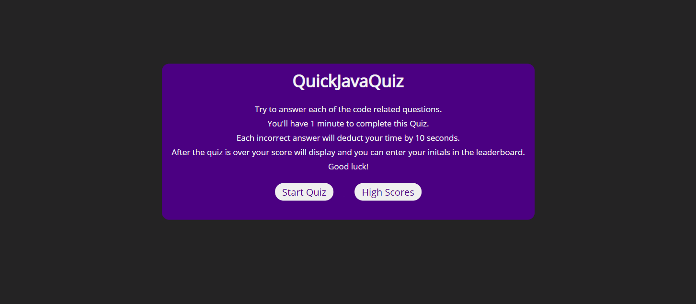

# Java Quick Quiz App

### Table of Contents

- [Description](#description)
- [Link to Application](https://austynwhaley.github.io/password-generator-3000/)
- [License](#license)

---

---

## Description

Had a lot of fun with this assignment, getting the chance to format and style from scratch taught me a lot more than what I thought I already knew. I did kind of have an issue with condencing the choice buttons while also keeping them centered so I instead kept them the width they're at now, its not super perfect but I dont think its a terrible eyesore. The hardest part(s) of the assignment for me I'd say was the high scores and setting them with a name attached. Truth be told there is some coding syntax and methods in my code I discovered while googling unrelentlessly that we haven't gone over in class too much. I'm really starting to notice with every assignment, how many differnt ways you can go about just programming one small detail.

---

## License

MIT License

Copyright (c) [2020] [Austyn Whaley]

Permission is hereby granted, free of charge, to any person obtaining a copy
of this software and associated documentation files (the "Software"), to deal
in the Software without restriction, including without limitation the rights
to use, copy, modify, merge, publish, distribute, sublicense, and/or sell
copies of the Software, and to permit persons to whom the Software is
furnished to do so, subject to the following conditions:

The above copyright notice and this permission notice shall be included in all
copies or substantial portions of the Software.

THE SOFTWARE IS PROVIDED "AS IS", WITHOUT WARRANTY OF ANY KIND, EXPRESS OR
IMPLIED, INCLUDING BUT NOT LIMITED TO THE WARRANTIES OF MERCHANTABILITY,
FITNESS FOR A PARTICULAR PURPOSE AND NONINFRINGEMENT. IN NO EVENT SHALL THE
AUTHORS OR COPYRIGHT HOLDERS BE LIABLE FOR ANY CLAIM, DAMAGES OR OTHER
LIABILITY, WHETHER IN AN ACTION OF CONTRACT, TORT OR OTHERWISE, ARISING FROM,
OUT OF OR IN CONNECTION WITH THE SOFTWARE OR THE USE OR OTHER DEALINGS IN THE
SOFTWARE.

---
[Back To The Top](#Java-Quick-Quiz-App)